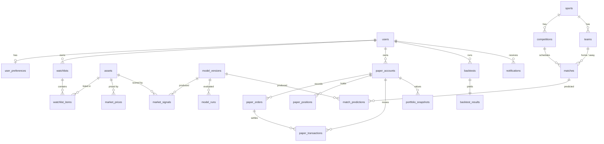

# Data model

PostgreSQL via Drizzle ORM. Schema: `db/schema/*.ts`; migrations: `db/migrations/*.sql`;
seed: `db/seed.ts`. **Optional in demo mode** — the app runs without a database.

Conventions: UUID primary keys (`gen_random_uuid()`), `created_at` / `updated_at` timestamps
(`timestamptz`), money as `numeric(20,6)`, prices `numeric(18,6)`, ratios `numeric(14,6)`, explicit foreign keys with
deliberate `ON DELETE` behaviour, `CHECK` constraints for invariants, and indexes for every
access path the app uses.

## Tables (23)

| Domain  | Table                             | Purpose / notable constraints                                                                       |
| ------- | --------------------------------- | --------------------------------------------------------------------------------------------------- |
| Users   | `users`                           | Identity (`auth_provider` + `auth_subject` unique) — ready for Clerk / Auth.js                      |
|         | `user_preferences`                | 1:1 preferences (theme, risk profile)                                                               |
| Markets | `assets`                          | Tradable universe (`symbol` unique)                                                                 |
|         | `market_prices`                   | OHLCV bars; unique `(asset_id, interval, ts)`; positivity and OHLC consistency checks               |
|         | `market_signals`                  | Composite signal snapshots with score, confidence, probability, components (jsonb)                  |
|         | `watchlists`, `watchlist_items`   | Per-user watchlists; unique `(watchlist_id, asset_id)`                                              |
| Sports  | `sports`, `competitions`, `teams` | Reference data (`key` unique)                                                                       |
|         | `matches`                         | Fixtures/results; home ≠ away check; indexes on competition/kick-off                                |
|         | `match_predictions`               | λ, 1X2, markets, score matrix (jsonb), confidence, uncertainty, model version                       |
| Models  | `model_versions`                  | Model registry (`key` + `version` unique, status)                                                   |
|         | `model_runs`                      | Evaluation / training runs with metrics (jsonb)                                                     |
| Trading | `paper_accounts`                  | Virtual accounts; `cash >= 0`, `starting_cash > 0`                                                  |
|         | `paper_orders`                    | Order ledger incl. rejections; `quantity > 0`; unique `(account_id, client_order_id)` (idempotency) |
|         | `paper_positions`                 | Derived holdings cache; unique `(account_id, symbol)`; `quantity >= 0`                              |
|         | `paper_transactions`              | Cash movements; `balance_after >= 0`                                                                |
|         | `portfolio_snapshots`             | Daily valuation; unique `(account_id, as_of)`                                                       |
|         | `backtests`, `backtest_results`   | Run config (date-order, capital, cost checks) and 1:1 results with equity curve                     |
| System  | `notifications`                   | Per-user notifications with read state                                                              |
|         | `audit_events`                    | **Append-only** audit trail (trigger blocks UPDATE/DELETE)                                          |



`audit_events.actor_id` is intentionally **not** a foreign key: audit rows must outlive the
actors they describe.

## Paper accounts in demo mode

Demo visitors are anonymous. Their account id is the random UUID in the `esocity_demo_sid`
cookie; `paper_accounts.user_id` is null for these accounts. With a database configured the
PostgreSQL store persists them; the order ledger is the source of truth and positions/cash are
rebuilt inside the same transaction (row lock on the account) on every mutation.

## Workflow

```bash
pnpm db:generate          # after editing db/schema — review the generated SQL
pnpm db:migrate           # apply migrations (uses DATABASE_URL)
pnpm db:seed              # upsert deterministic demo data (idempotent)
pnpm db:seed --reset      # truncate everything first (never against production)
```

Custom SQL (such as the audit trigger in `0001_audit_events_append_only.sql`) lives in its own
migration so it is reviewed like any other schema change.

## Future: time-series storage

At real data volumes, move `market_prices` to TimescaleDB hypertables (or partition by month)
and add continuous aggregates for intraday bars — see ROADMAP Phase 2.
