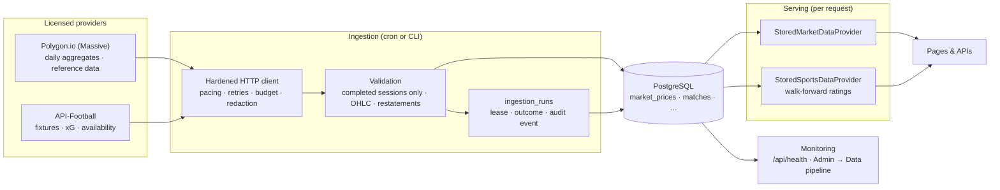

# Data pipeline

Licensed market and football data reach the platform through one pipeline: a scheduled job
fetches from the provider, validates, writes to PostgreSQL and records the run; pages read the
database — **never the provider API**. Provider quotas, latency and outages therefore cannot take
pages down, and every visitor sees the same validated data set.

The synthetic demo providers (`demo`, the default) need none of this: no keys, no database, no
ingestion.

## Enabling licensed data

1. **PostgreSQL** — set `DATABASE_URL` and run `pnpm db:migrate` (migration `0002` adds
   `ingestion_runs`). Seeding is optional; demo rows (`source = 'demo'`, fictional competitions)
   never mix with licensed ones.
2. **Keys** — `POLYGON_API_KEY` and/or `API_FOOTBALL_KEY` (server-side only).
3. **Verify** — `pnpm ingest markets --dry-run` / `pnpm ingest sports --dry-run` fetch and
   validate without writing anything.
4. **Backfill** — `pnpm ingest markets` and `pnpm ingest sports` from a trusted machine (no time
   limit; the free Polygon plan needs a few minutes for eight symbols).
5. **Switch** — `MARKET_DATA_PROVIDER=polygon`, `SPORTS_DATA_PROVIDER=api-football`, redeploy.
   Each domain switches independently.
6. **Schedule** — set `CRON_SECRET` (≥16 random characters). `vercel.json` runs
   `/api/cron/ingest/markets` on weekdays at 22:15 UTC (after the US close in both EST and EDT)
   and `/api/cron/ingest/sports` daily at 06:15 UTC. Vercel Cron authenticates with
   `Authorization: Bearer <CRON_SECRET>`; any other caller gets 401. Domains still on `demo`
   answer 200 "skipped" without doing anything.

`next build` never reads the database: with a licensed provider the data-driven pages render
per request (see ARCHITECTURE.md → Key decisions), so a deploy succeeds before the first
ingestion and while the database is unreachable.

## Markets — Polygon.io

| Step         | Behaviour                                                                                                                                                                                                                                                                                 |
| ------------ | ----------------------------------------------------------------------------------------------------------------------------------------------------------------------------------------------------------------------------------------------------------------------------------------- |
| Requests     | `GET /v2/aggs/ticker/{t}/range/1/day/{from}/{to}?adjusted=true&sort=asc` (pagination via `next_url`, re-based onto the configured origin) and `GET /v3/reference/tickers/{t}` for symbols without curated reference data. Paced to `POLYGON_REQUESTS_PER_MINUTE`.                         |
| Dates        | Daily aggregates are stamped 00:00 America/New_York; they are read as New York dates.                                                                                                                                                                                                     |
| Sessions     | Only bars up to the **last completed NYSE session** are stored (`lib/markets/calendar.ts`: holidays with weekend observance, Good Friday, Juneteenth from 2022, 13:00 early closes, unscheduled closures). No partially formed bar is ever written.                                       |
| First run    | Backfills `MARKET_DATA_BACKFILL_DAYS` (default 730) calendar days.                                                                                                                                                                                                                        |
| Later runs   | Re-fetch 14 days before the last stored bar through the last completed session; write only new or changed bars.                                                                                                                                                                           |
| Restatements | If any overlapping bar moved more than 0.5 % (a split adjustment or an upstream correction), the symbol's entire stored history is re-fetched and swapped in one transaction.                                                                                                             |
| Validation   | Positive finite prices; OHLC consistency (≤ 0.5 % rounding repaired, larger violations rejected); whole non-negative volume; unique ascending dates; prices rounded to the stored precision. Warnings (kept, not rejected): one-day moves above 40 %, bars on holidays, missing sessions. |
| Adjustment   | Bars are **split-adjusted only** — dividends are not adjusted, so long-horizon returns understate total return.                                                                                                                                                                           |
| Serving      | `StoredMarketDataProvider` loads the universe in two queries (60 s cache, single-flight). Symbols with less than 130 bars are withheld until enough history exists. Quotes are the last close, labelled delayed.                                                                          |

## Football — API-Football

A run spends at most `API_FOOTBALL_MAX_REQUESTS_PER_RUN` requests (the free plan allows 100 a
day), essentials first:

1. `/leagues?id=…&current=true` — current season (or `API_FOOTBALL_SEASON`) and coverage flags.
2. `/fixtures?league=…&season=…` — every fixture; only new or changed ones are written.
3. `/teams?league=…&season=…` — once per season (codes, venues). Short names are derived so two
   clubs are never ambiguous ("Manchester City" and "Manchester United" stay in full).
4. Previous season's fixtures — once — so ratings start from last season, not from "average".
5. `/injuries?fixture=…` for fixtures in the next seven days (availability: ruled out /
   doubtful per side), refreshed every run.
6. `/fixtures?ids=…` (20 per request) — expected goals for finished fixtures not yet checked.

Steps 4–6 are skipped (with a warning) when the budget runs out; the next run continues.
Statuses map to `scheduled` (TBD, NS), `live` (1H, HT, 2H, ET, BT, P, LIVE, SUSP, INT),
`finished` (FT, AET, PEN — stored as the **90-minute** score), `postponed` (PST) and `cancelled`
(CANC, ABD, AWD, WO). Awarded results carry no played score and never feed the ratings.

Serving (`StoredSportsDataProvider`) rebuilds pre-match inputs walk-forward: see
SPORTS_ENGINE.md → Licensed data. Standings are computed from stored results — official tables
can differ (points deductions, head-to-head tie-breakers).

## Runs, leases and audit

Every non-dry run inserts an `ingestion_runs` row. A partial unique index allows one `running`
row per domain, so overlapping cron invocations or a manual run during a scheduled one back off
("skipped"). A run still `running` after 20 minutes is marked `abandoned` by the next one.
Outcomes: `succeeded`, `partial` (some items skipped or failed), `failed`. Each run is also
recorded in the audit trail (`ingestion.run`).

The cron route stops starting new items after 240 s (`maxDuration` 300 s); remaining items are
`skipped` and resume on the next run from what is stored.

## Monitoring

| Signal                         | Rule                                                                                                                                      |
| ------------------------------ | ----------------------------------------------------------------------------------------------------------------------------------------- |
| Market symbol freshness        | Sessions between the last stored bar and the last completed NYSE session: ≤ 1 fresh (the post-close job may not have run yet), ≥ 2 stale. |
| Market domain                  | `down` when no symbol can be served; `degraded` when any symbol is stale, missing or withheld, or the last run failed.                    |
| Football overdue results       | Fixtures still unresolved 24 hours after kick-off.                                                                                        |
| Football domain                | `down` with no stored competition; `degraded` with overdue results, no successful run in 36 hours, or a failed last run.                  |
| `/api/health` → `checks.*Data` | `status`, `freshness` summary, `lastIngestion`. `down` → HTTP 503; stale data → `degraded` (200).                                         |
| Admin → Data pipeline          | Per-symbol / per-competition freshness, xG coverage, last and last-successful run, recent runs with warnings and errors.                  |

## Runbook

| Symptom                                                 | Likely cause and fix                                                                                                                                                          |
| ------------------------------------------------------- | ----------------------------------------------------------------------------------------------------------------------------------------------------------------------------- |
| Run `failed`: "responded 401/403" or "rejected (token)" | Invalid or revoked key. Rotate the key in the environment; runs abort early on authentication errors.                                                                         |
| "rejected (plan)"                                       | The plan does not cover the season. Pin `API_FOOTBALL_SEASON` to a covered season or upgrade.                                                                                 |
| Items `skipped` — request budget                        | Daily quota reached (API-Football) — the next run continues. Raise `API_FOOTBALL_MAX_REQUESTS_PER_RUN` only if the plan allows.                                               |
| Items `skipped` — time budget                           | Free-tier pacing (5 requests/minute) and many symbols. Run `pnpm ingest markets` once, or raise `POLYGON_REQUESTS_PER_MINUTE` on a paid plan.                                 |
| Symbol `restated`                                       | Expected after splits; history was re-ingested. Signals and backtests recompute automatically.                                                                                |
| Symbol "Building history"                               | Fewer than 130 bars (new listing or short backfill). It appears once enough sessions exist.                                                                                   |
| Pages show "This view could not be loaded"              | The error page lists the failing data domain. Usually nothing is ingested yet (run the CLI) or PostgreSQL is unreachable (`/api/health` → database).                          |
| Run `abandoned`                                         | The process stopped mid-run (timeout, deploy). Every stored bar was validated before writing and restatements swap atomically; the next run resumes from the last stored bar. |

## Limits and next steps

End-of-day data only (no intraday or real-time quotes), split-adjusted but not
dividend-adjusted prices, league fixtures only (cup and European matches are not ingested, so
rest days can be overstated), and availability counted per player without player importance.
Because licensed pages render per request and stream behind the platform loading state, an
unknown symbol or match id shows the not-found page with HTTP 200 rather than 404 (the platform
area is `noindex` either way; demo mode still answers 404).
TimescaleDB/partitioning, additional providers and live quotes are on the roadmap.
